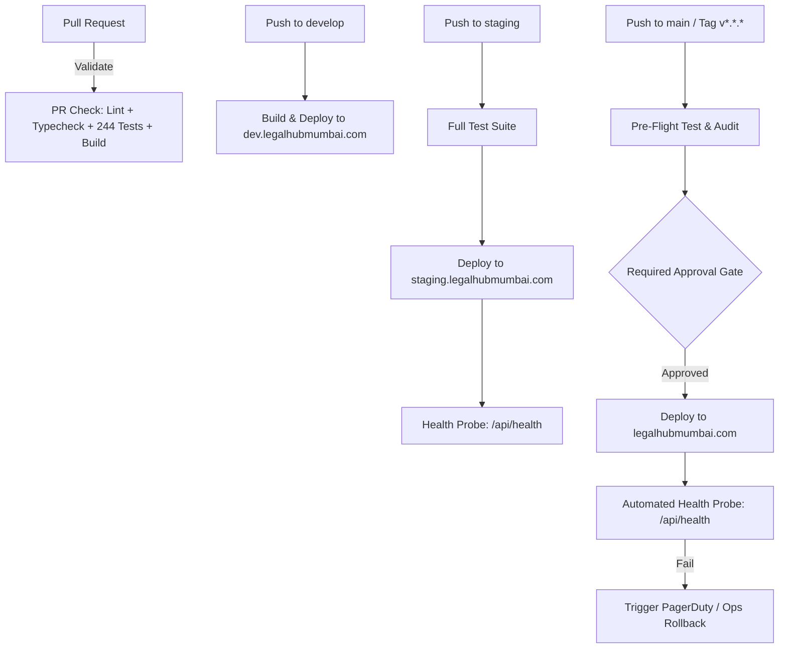

# Production Deployment & Rollback Strategy

## 1. Multi-Environment Architecture

LegalHubMumbai operates three strictly isolated environments to ensure zero accidental pollution of production legal marketplace data and financial records.

| Environment | Branch Trigger | Target Domain | Firebase Project ID | Secrets Scope | Access Level |
| :--- | :--- | :--- | :--- | :--- | :--- |
| **Development** | `develop` | `https://dev.legalhubmumbai.com` | `legalhubmumbai-dev` | GitHub Environment: `development` | Engineering Team |
| **Staging** | `staging` | `https://staging.legalhubmumbai.com` | `legalhubmumbai-staging` | GitHub Environment: `staging` | QA, Product & Stakeholders |
| **Production** | `main` / `v*.*.*` | `https://legalhubmumbai.com` | `legalhubmumbai-prod` | GitHub Environment: `production` | Restricted (Approval Required) |

---

## 2. GitHub Actions Pipeline Matrix



### Workflow Files
- [`.github/workflows/pull-request.yml`](file:///.github/workflows/pull-request.yml): Automated validation on PR open/update.
- [`.github/workflows/development.yml`](file:///.github/workflows/development.yml): Automated preview deployment for active engineering branches.
- [`.github/workflows/staging.yml`](file:///.github/workflows/staging.yml): Integration deployment for QA and acceptance sign-offs.
- [`.github/workflows/production.yml`](file:///.github/workflows/production.yml): Production deployment protected by environment approval gates.

---

## 3. GitHub Secrets Management Matrix

No secrets or API keys are stored in source code. All secrets are configured in GitHub Repository and Environment settings:

### Environment: `production`
- `PROD_FIREBASE_API_KEY`: Firebase web client API key for production.
- `PROD_FIREBASE_PROJECT_ID`: `legalhubmumbai-prod`.
- `PROD_RAZORPAY_KEY_ID`: Live Razorpay merchant key ID (`rzp_live_*`).
- `PROD_RAZORPAY_KEY_SECRET`: Live Razorpay API secret key.
- `PROD_RAZORPAY_WEBHOOK_SECRET`: Live Razorpay cryptographic webhook secret.
- `FIREBASE_SERVICE_ACCOUNT_LEGALHUBMUMBAI_PROD`: Service account JSON with deployment privileges.

### Environment: `staging`
- `STAGING_FIREBASE_API_KEY`: Firebase web client API key for staging.
- `STAGING_FIREBASE_PROJECT_ID`: `legalhubmumbai-staging`.
- `STAGING_RAZORPAY_KEY_ID`: Test Razorpay merchant key ID (`rzp_test_*`).
- `STAGING_RAZORPAY_KEY_SECRET`: Test Razorpay API secret key.
- `STAGING_RAZORPAY_WEBHOOK_SECRET`: Test Razorpay webhook secret.
- `FIREBASE_SERVICE_ACCOUNT_LEGALHUBMUMBAI_STAGING`: Service account JSON for staging.

---

## 4. Production Release Approval Strategy

1. **Branch Protection on `main`**:
   - Require pull request reviews before merging (minimum 1 peer approval).
   - Require status checks to pass (`Lint, Typecheck, Test & Build Verification`).
   - Require linear commit history.
2. **Environment Protection on `production`**:
   - Required reviewers: DevOps Lead / Engineering Lead.
   - Deployment branches: `main` only.
   - Wait timer: 0 min (or configurable delay).

---

## 5. Step-by-Step Rollback Procedures

If a critical bug, payment regression, or performance degradation is detected post-deployment, execute the appropriate rollback protocol immediately.

### Option A: Instant Zero-Downtime Hosting Rollback (Recommended: < 60 seconds)

Firebase Hosting retains immutable versions of all past deployments. To roll back instantly to the prior working release without rebuilding:

```bash
# 1. Authenticate with Firebase CLI
firebase login:ci

# 2. View deployment release history
firebase hosting:clone legalhubmumbai-prod:live legalhubmumbai-prod:live

# 3. Roll back to specific prior version channel
firebase hosting:rollback --project legalhubmumbai-prod
```

### Option B: Git Tag Re-Deployment via GitHub Actions

If code changes or Cloud Functions must also be rolled back:

```bash
# 1. Identify last stable release tag (e.g., v1.0.4)
git tag -l -n1

# 2. Revert main or trigger workflow dispatch with previous tag
gh workflow run production.yml --ref v1.0.4 -f release_notes="Emergency rollback to v1.0.4"
```

### Option C: Cloud Functions Rollback

If a backend Cloud Function causes errors:

```bash
# Redeploy functions from the previous known good commit
git checkout tags/v1.0.4 -- functions/
firebase deploy --only functions --project legalhubmumbai-prod
```

### Option D: Firestore Security Rules & Indexes Rollback

```bash
# Restore rules from previous tag
git checkout tags/v1.0.4 -- firestore.rules firestore.indexes.json storage.rules
firebase deploy --only firestore:rules,storage --project legalhubmumbai-prod
```

---

## 6. Post-Deployment Automated Health Check (`/api/health`)

Every staging and production workflow executes an automated health probe after deployment completes:

```bash
curl -fsS -m 10 https://legalhubmumbai.com/api/health
```

Expected JSON response:
```json
{
  "status": "ok",
  "service": "legalhubmumbai-web",
  "environment": "production",
  "version": "1.0.0",
  "uptimeSeconds": 142,
  "timestamp": "2026-09-18T12:00:00.000Z",
  "checks": {
    "server": "healthy",
    "database": "ready",
    "vault": "ready"
  }
}
```

If the health probe fails to return `HTTP 200 OK` within the allocated retry window (6 attempts with exponential backoff), the workflow exits with a non-zero status code and triggers immediate alerts.

---

## 7. Incident Response & Post-Mortem Workflow

1. **Triage**: Acknowledge alert, determine customer impact (e.g., booking unlocks, search, payments).
2. **Mitigate**: Execute **Option A (Instant Hosting Rollback)** or place platform in maintenance mode via platform configuration settings if data integrity is at risk.
3. **Analyze**: Inspect Firebase Cloud Logging and error logs.
4. **Fix & Verify**: Fix bug in hotfix branch -> merge to `develop` -> test in `staging` -> promote to `main`.
5. **Post-Mortem**: Document root cause, detection time, resolution time, and preventative action items within 48 hours.
